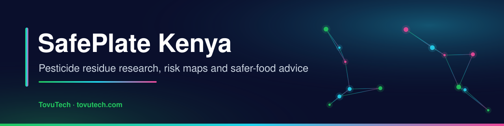
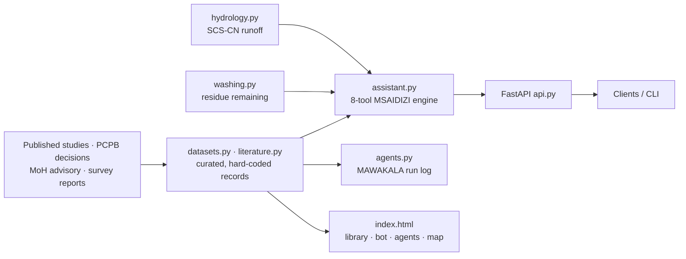

<p align="center">
  
  
  
  
  <a href="https://www.tovutech.com/projects/safeplate/"></a>
</p>

## What it is

**SafePlate Kenya** is a research prototype on **pesticide residues in fresh produce sold in Kenyan markets**. It gathers published studies and regulatory decisions into a searchable library, maps market "hotspots" and supply corridors (including produce moving from Central Kenya to Garissa Wholesale Market), and gives consumers and farmers simple, sourced advice: how much residue home washing can remove and which registered biopesticides can replace hazardous actives.

It is meant for county health and agriculture officers, researchers and informed consumers. The figures are compiled from published sources and simple models — they are indicative and are **not laboratory results produced by this project**.

## What it does

- 📚 **MAKTABA research library** – 46 references (peer-reviewed studies, reviews, regulatory instruments, reports and datasets) with topic-tag filters, copy-citation, CSV and BibTeX export (`literature.py`, web page).
- 💬 **MSAIDIZI assistant** – a deterministic, offline question-answering engine that chains 8 local tools (active-ingredient profile, county risk, alternatives, wash calculation, runoff, literature search, market risk, advisory) and shows its sources. No API key needed. CLI: `python3 -m safeplate_platform.assistant`.
- 🤖 **MAWAKALA agent suite** – 8 rule-based "agents" (surveillance targeting, advisory watch, MRL audit, wash coach, substitution planner, provenance audit, literature indexer, assistant) that produce an auditable run log (`agents.py`). A key point it surfaces: chlorpyrifos and acephate are already withdrawn in Kenya yet reported in market produce — an enforcement gap.
- 🧼 **Wash model** – estimates the residue fraction remaining after cold water, salt, vinegar or baking-soda washing, soaking time and peeling, adjusted for each active's solubility and systemic behaviour (`washing.py`; e.g. chlorfenapyr + 5-min cold rinse → ~57% remaining).
- 🌧️ **Runoff model** – SCS Curve Number runoff depth for pesticide wash-off from fields (`hydrology.py`; self-test Q(P = 55 mm, CN = 79) = 15.80 mm).
- 🗺️ **RAMANI map** – Leaflet map of market hotspots and supply-corridor lines, plus a county residue-pressure index and trend charts (`datasets.py`, `analytics.py`).
- 🔌 **REST API** – FastAPI endpoints for the same tools, and an optional Streamlit "control room" (`dashboard.py`).

## How it works



## Tech stack

| Area | Tools |
|---|---|
| Core | Python 3.8+ (standard library models), `setuptools` package `safeplate_platform` |
| API | FastAPI, Uvicorn, Pydantic |
| Web | Static HTML/CSS/JS, Leaflet 1.9, Chart.js |
| Optional dashboard | Streamlit, Folium, streamlit-folium |
| Assets | `generate_assets.py`, `generate_diagrams.py` (illustrations and diagrams in `assets/images/`) |

## Getting started

```bash
git clone https://github.com/jmsmuigai/Pesticide-Residue-Mitigation.git
cd Pesticide-Residue-Mitigation
bash install.sh                 # creates .venv, installs the package, runs self-tests
source .venv/bin/activate
pip install fastapi uvicorn     # for the REST API (streamlit folium streamlit-folium for the dashboard)
```

Run:

```bash
python3 -m safeplate_platform.assistant   # MSAIDIZI assistant (CLI)
python3 safeplate_platform/agents.py      # MAWAKALA agent sweep + run log
make web                                  # static portal → http://localhost:8080
make serve                                # FastAPI → http://localhost:8000/docs
make dashboard                            # Streamlit control room
make test                                 # hydrology, washing and agent self-tests
```

API endpoints: `GET /health`, `/abstract`, `/literature`, `/agents`, `/analytics/trends`, `/actives`, `/counties`; `POST /assistant`, `/hydrology/calculate`, `/wash`.

Optional: copy `.env.example` to `.env` and set `GOOGLE_API_KEY`. Note that `gemini_agent.py` currently returns **templated outputs** (prompt manifests, briefing structures) and does not yet call the Gemini API.

See [`HELP.md`](HELP.md) for a step-by-step user guide.

## Data & privacy

- Market, residue, trend and county-index figures are **hard-coded summaries** in `datasets.py`, `analytics.py` and `mine_and_clean.py`, compiled from the sources in the library (e.g. KOAN, University of Nairobi and laboratory survey reports, PCPB registers). Check the original source before citing any number.
- Included documents: a Ministry of Health advisory PDF to county governments on residues in market produce, and a concept document (`Mapping Pesticide Hotspots with AI.docx`). The `.gdoc` / `.gsheet` files are Google Drive shortcuts and only open for users with access.
- No personal data is collected or stored.

## Status & roadmap

**Status:** research prototype. Models are simplified (heuristic wash factors, textbook SCS-CN), and no field sampling was carried out by this project.

Possible next steps:
- Load residue data from versioned CSV files with full citations instead of hard-coded values.
- Calibrate the wash model against published removal studies, with uncertainty ranges.
- Connect `gemini_agent.py` to the API with fact-checking, or remove it.
- Add a `requirements.txt` covering the API and dashboard extras, and a `LICENSE` file (the previous README showed an MIT badge, but no licence file is included).

## Security

See [SECURITY.md](SECURITY.md). Keys go in `.env` only.

---

<p align="center">
  <b>Built by James M. Mburu · TovuTech Limited</b><br>
  <a href="https://www.tovutech.com">https://www.tovutech.com</a> · <a href="mailto:intelligence@tovutech.com">intelligence@tovutech.com</a><br>
  📖 Case study: <a href="https://www.tovutech.com/projects/safeplate/">tovutech.com/projects/safeplate</a>
</p>
